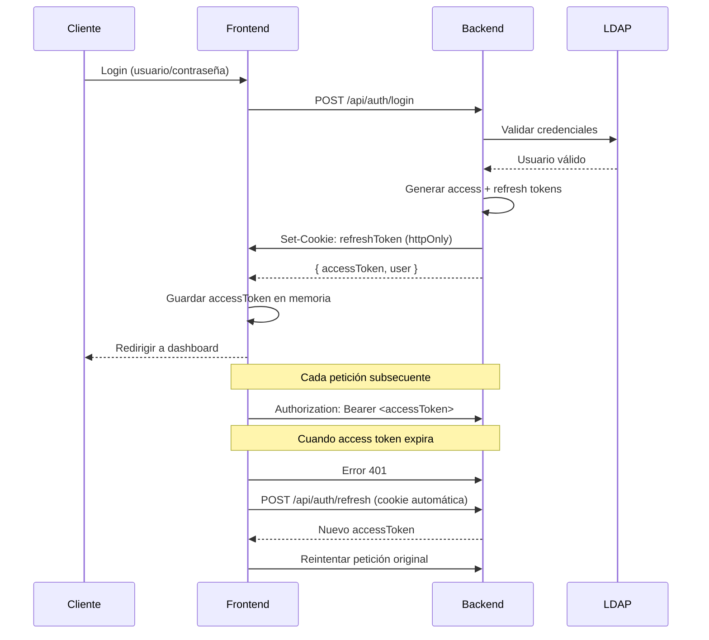

# 🔐 Sistema de Autenticación Seguro - Agenda UC

## 🚀 Instalación y Configuración

### Backend (NestJS)
```bash
cd backend
npm install @nestjs/common @nestjs/core @nestjs/jwt express cookie-parser
npm install -D @types/express @types/cookie-parser
```

### Frontend (React + Vite)
```bash
cd frontend
npm install react-router-dom sonner @tanstack/react-query
npm install -D @types/react-router-dom
```

## 🔧 Configuración

### 1. Variables de entorno (.env)
```env
# Backend
JWT_SECRET=your-super-secret-jwt-key-change-in-production
JWT_REFRESH_SECRET=your-super-secret-refresh-key-change-in-production
FRONTEND_URL=http://localhost:3000
NODE_ENV=development

# LDAP (ya configurado)
LDAP_URL=ldap://localhost:389
LDAP_BIND_DN=ldap.search@reduc.edu.cu
LDAP_BIND_CREDENTIALS=1234asdf*
LDAP_SEARCH_BASE=DC=REDUC,DC=EDU,DC=CU
```

### 2. Iniciar servicios
```bash
# Terminal 1: Backend
cd backend
npm run start:dev

# Terminal 2: Frontend  
cd frontend
npm run dev

# Terminal 3: Base de datos (si es necesario)
docker-compose up -d
```

## 🛡️ Características de Seguridad Implementadas

### ✅ Backend (NestJS)
- **JWT con refresh tokens**: Access token (15 min) + Refresh token (7 días)
- **Cookies httpOnly**: Refresh tokens nunca expuestos al JavaScript del cliente
- **CORS configurado**: Solo permite origen del frontend
- **Prefix global**: Todas las rutas bajo `/api`
- **Validación DTOs**: Usando Zod para validación de entrada
- **RBAC**: Guard de roles con decorador `@Roles()`
- **Trazas de auditoría**: Logs de login/logout/fallos

### ✅ Frontend (React)
- **Proxy /api**: Vite redirige automáticamente a backend
- **Refresh automático**: Interceptor para renovar tokens expirados
- **Protección de rutas**: Componente `ProtectedRoute` con roles
- **Estado seguro**: No se almacenan tokens en localStorage
- **Contexto de auth**: Hook `useAuth()` centralizado
- **Feedback visual**: Toasts para éxito/error en español

## 🔄 Flujo de Autenticación



## 📚 Ejemplos de Uso

### 1. Proteger endpoint en backend
```typescript
@Controller('admin')
export class AdminController {
  @Get('users')
  @UseGuards(JwtAuthGuard, RolesGuard)
  @Roles('ADMINISTRADOR', 'DIRECTIVO')
  async getUsers() {
    return this.adminService.getUsers();
  }
}
```

### 2. Proteger ruta en frontend
```tsx
<Route 
  path="/admin" 
  element={
    <ProtectedRoute roles={['ADMINISTRADOR']}>
      <AdminPage />
    </ProtectedRoute>
  } 
/>
```

### 3. Hook useAuth
```tsx
function MyComponent() {
  const { user, isAuthenticated, hasRole, logout } = useAuth();
  
  if (!isAuthenticated) return <LoginPage />;
  
  return (
    <div>
      <h1>Hola {user.name}</h1>
      {hasRole('ADMINISTRADOR') && (
        <AdminPanel />
      )}
      <button onClick={logout}>Cerrar Sesión</button>
    </div>
  );
}
```

### 4. Fetch seguro con TanStack Query
```tsx
const { data, isLoading, error } = useQuery({
  queryKey: ['activities'],
  queryFn: () => apiClient.request<Activity[]>('/activities'),
  staleTime: 5 * 60 * 1000, // 5 minutos
});
```

## 🎯 Próximos Pasos

1. **Instalar dependencias faltantes**:
   ```bash
   cd frontend
   npm install sonner @tanstack/react-query zustand
   ```

2. **Configurar TanStack Query Provider** en `main.tsx`:
   ```tsx
   import { QueryClient, QueryClientProvider } from '@tanstack/react-query';
   
   const queryClient = new QueryClient();
   
   ReactDOM.createRoot(document.getElementById('root')!).render(
     <QueryClientProvider client={queryClient}>
       <App />
     </QueryClientProvider>
   );
   ```

3. **Reemplazar App.tsx** con `App-example.tsx`

4. **Probar el flujo completo**:
   - Login con `angel.napoles` / `1234asdf*`
   - Verificar cookies en DevTools
   - Probar rutas protegidas
   - Verificar refresh automático

## 🔍 Debug y Troubleshooting

### Verificar cookies
```javascript
// En DevTools Console
document.cookie; // No debería mostrar refreshToken (httpOnly)
```

### Logs del backend
```bash
# Ver logs en tiempo real
tail -f logs/auth.log
```

### Estado de autenticación
```javascript
// En React DevTools o Console
window.__REACT_DEVTOOLS_GLOBAL_HOOK__.renderers.get(1).current.child.stateNode.context
```

## 🚨 Importante para Producción

- [ ] Cambiar secrets JWT en variables de entorno
- [ ] Habilitar HTTPS (SSL)
- [ ] Configurar CORS para dominio real
- [ ] Implementar rate limiting
- [ ] Logs estructurados con rotación
- [ ] Monitoreo de sesiones activas
- [ ] Blacklist de refresh tokens revocados